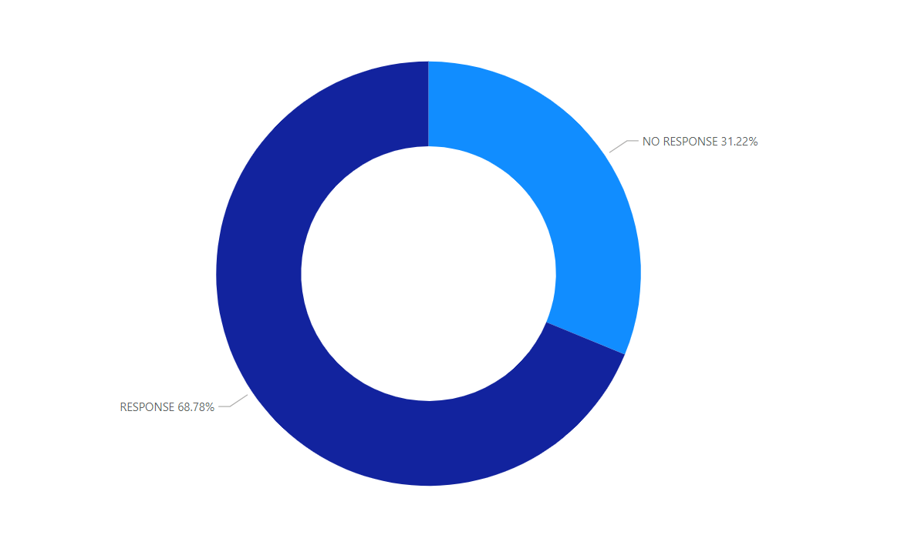
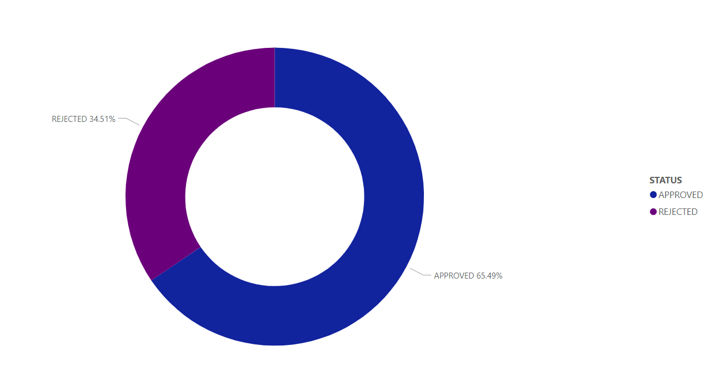
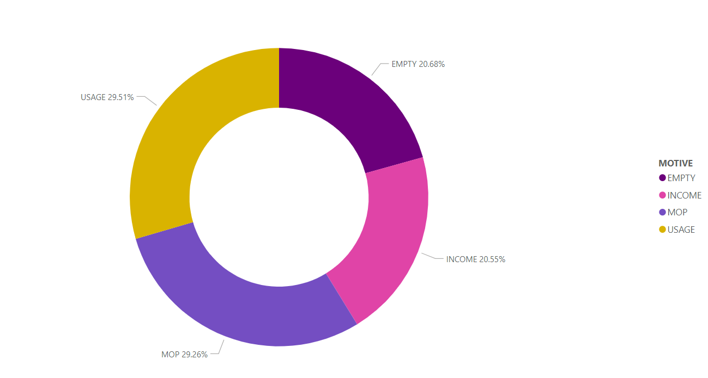
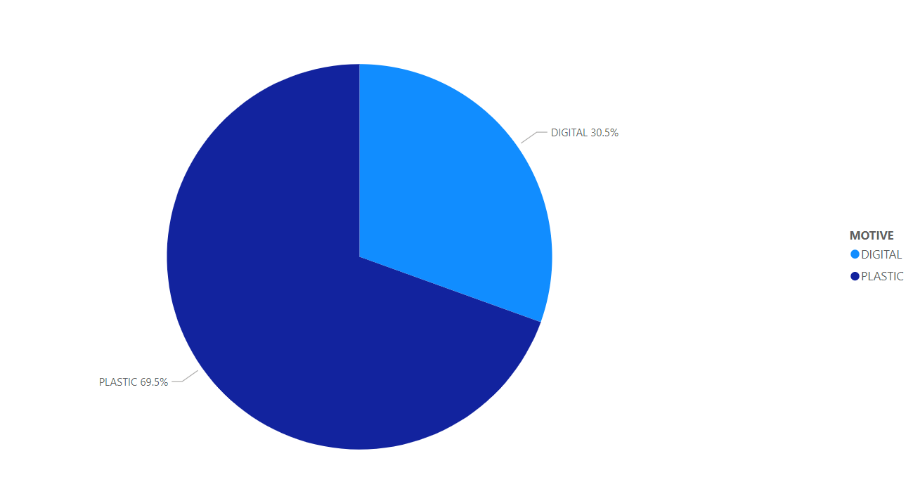
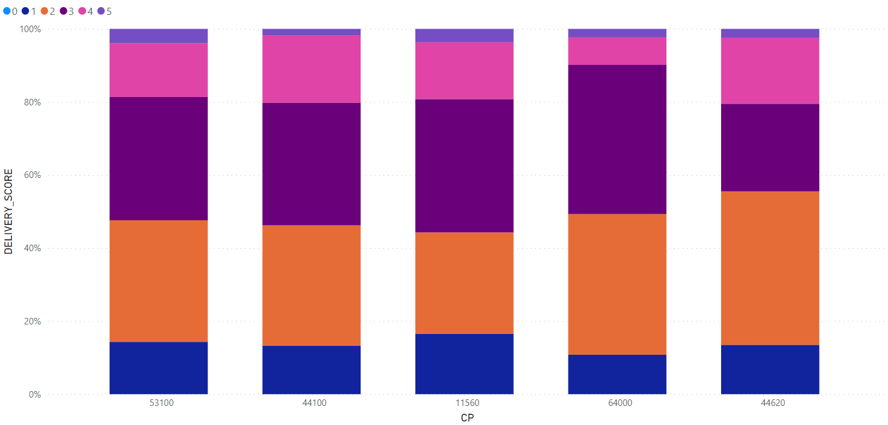

# BI_challenge
[1] Key Performance Indicators

*   Average usage over a considered period
*   Average consumption in year-on-year periods
*   Relationship between the number of visits to the app and the number of completed purchases
*   Thanks to credit card we can measure a customer's purchases frequency
*   The number of approved credit cards and how many of those are in continuous use
*   Customer churn, relationship between number of customers we had at the beginning and the number of customers we lose in a certain time

How often?

The KPIs need a lot of data to work on different statistics, there are customers every day but for important results and comparisons over time I propose quarterly, semi-annual and annual periods. 

[2] Stakeholders

If I take the example of 'dormant', I thing its "normal" to understand the concept in the way of 'trending' that if a customer are 4 moths inactive is more likely to conttinue like this than return but for the business its important to have a definition of a concept not only the interpretation of the concept and let every one be familiar with this.

[3] Data

The challenge of having multiple systems is the size or range that each one has, if we take the third system we have a line for a customer with all the personal information and if we take the second system we know that it feeds on every time a customer ask for a credit, maybe if we want a historical analysis of credit we can use the second system but if we want a simple analysis for a few customers and we bring the data for second to third maybe we are going to work with data that we don´t need and and its going to take more time.
We need a complete network of all customers maybe active customers to 6 months inactive customers with personal information, last movement of credit, etc. and all the teams can use it without excluding any movement. 

[4]

; 
 

